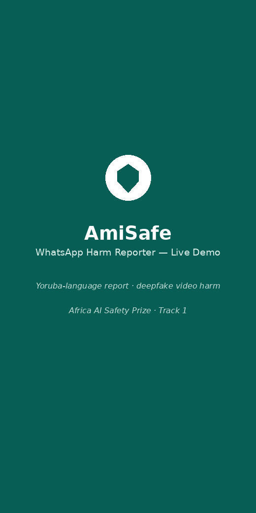
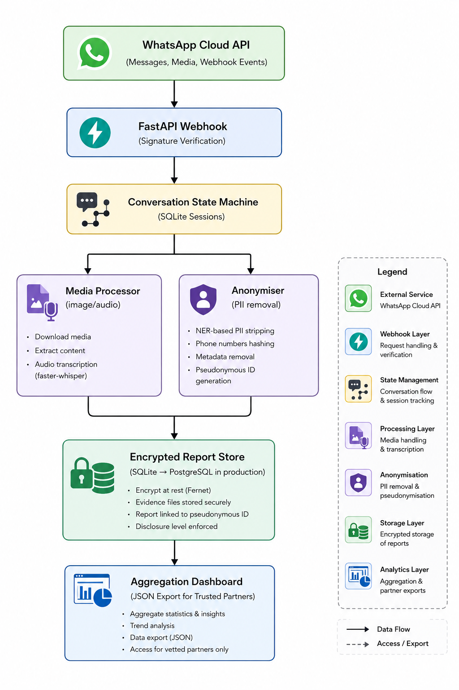

# AmiSafe WhatsApp Bot

<div align="center">

# 🛡️ AmiSafe WhatsApp Bot

### Community-led AI harm reporting via WhatsApp for African internet users

Submit structured, evidence-backed and privacy-preserving AI harm reports directly from WhatsApp — no app installation, no account creation, and no technical expertise required.




</div>

---

## Overview

AmiSafe extends the AmiSafe ecosystem to mobile-first African communities through WhatsApp.

Many internet users across Africa primarily access the internet through mobile devices and messaging platforms rather than web browsers. This bot enables anyone to safely document and report AI-related harms using a familiar communication channel.

Users can submit anonymised, evidence-backed reports entirely within WhatsApp.

No application download, registration, or personal identifiers are required.

---

## Key Features

✅ Multi-language support (8 African languages)

✅ Structured AI harm reporting workflow

✅ Evidence collection (images, screenshots, voice notes)

✅ Privacy-preserving report storage

✅ User-controlled disclosure levels

✅ Automatic anonymisation

✅ End-to-end encrypted report persistence

✅ Aggregated insights for trusted research partners

---

## Supported Languages

- English
- Hausa
- Yoruba
- Igbo
- Swahili
- Amharic
- Somali
- Zulu
- Nigerian Pidgin

---

## Supported AI Harm Categories

Users can report:

- 🖼️ Fake Image or Video
- 📰 False Information
- ⚖️ Unfair Treatment
- 🚫 Harassment or Intimidation
- 💰 Financial Harm
- 📝 Other

---

## User Journey

The reporting experience is intentionally simple.

1. User opens WhatsApp and sends a message.
2. AmiSafe greets the user in their preferred language.
3. The bot guides them through AI harm categories.
4. The user uploads supporting evidence.
5. The user selects a disclosure preference.
6. AmiSafe anonymises and securely stores the report.
7. A reference ID is returned to the user.

---

## System Architecture

The AmiSafe WhatsApp Bot follows a privacy-by-design architecture that securely collects, anonymises, stores, and aggregates AI harm reports submitted through WhatsApp.

<div align="center">



</div>

### Architecture Components

| Component | Responsibility |
|-----------|----------------|
| WhatsApp Cloud API | Receives user messages, media, and webhook events |
| FastAPI Webhook | Verifies requests and orchestrates message processing |
| Conversation State Machine | Maintains multi-step reporting sessions |
| Media Processor | Handles image, screenshot, and audio processing |
| Anonymiser | Removes personally identifiable information (PII) |
| Encrypted Report Store | Securely stores reports and evidence |
| Aggregation Dashboard | Generates aggregate insights for trusted partners |

---

## Privacy & Security by Design

| Component | Implementation |
|-----------|----------------|
| No account required | Sessions use rotating pseudonymous IDs |
| Phone numbers | HMAC-SHA256 hashing |
| Evidence files | EXIF removal + encryption |
| Text submissions | Named entity anonymisation |
| Audio | Local transcription + deletion |
| Disclosure controls | User-selected access permissions |
| Public outputs | Aggregated insights only |

---

## Disclosure Levels

| Level | Description | Access |
|------|-------------|--------|
| 🔒 Private | Stored locally and never shared | Reporter only |
| 🔍 Anonymous Research | Pseudonymous report with evidence hashes | Approved researchers |
| 🤝 Verified Partner | Fully anonymised report | Trusted civil society organisations |

---

# Getting Started

## Prerequisites

- Python 3.10+
- Meta Business Account
- WhatsApp Cloud API access
- Public HTTPS endpoint

For local development, ngrok is recommended.

---

## Installation

### Clone repository

```bash
git clone https://github.com/adegokeisrael/amisafe-whatsapp-bot.git

cd amisafe-whatsapp-bot
```

### Create virtual environment

Linux/Mac:

```bash
python -m venv venv

source venv/bin/activate
```

Windows:

```bash
python -m venv venv

venv\Scripts\activate
```

### Install dependencies

```bash
pip install -r requirements.txt
```

---

## Environment Configuration

Create your environment file.

```bash
cp .env.example .env
```

Populate it with your credentials.

```env
WHATSAPP_TOKEN=

WHATSAPP_PHONE_NUMBER_ID=

VERIFY_TOKEN=

ENCRYPTION_KEY=

DATABASE_URL=sqlite:///./amisafe.db

PARTNER_API_KEY=
```

Generate an encryption key:

```bash
python -c "from cryptography.fernet import Fernet; print(Fernet.generate_key().decode())"
```

---

## Run Locally

```bash
uvicorn main:app --reload --port 8000
```

---

## Expose Locally Using ngrok

```bash
ngrok http 8000
```

In the Meta App Dashboard:

1. Navigate to:

```
WhatsApp → Configuration → Webhook
```

2. Set:

```text
Callback URL:
https://your-ngrok-url.ngrok.io/webhook

Verify Token:
Your VERIFY_TOKEN
```

3. Subscribe to:

```text
messages
```

---

## Production Deployment

Build Docker image:

```bash
docker build -t amisafe-bot .
```

Run container:

```bash
docker run -d -p 8000:8000 --env-file .env amisafe-bot
```

Update your Meta webhook to your production HTTPS domain.

---

## API Endpoints

| Endpoint | Method | Description |
|----------|--------|-------------|
| `/webhook` | GET | Webhook verification |
| `/webhook` | POST | Incoming WhatsApp messages |
| `/dashboard/reports` | GET | Aggregated analytics |
| `/dashboard/export` | GET | Partner export |
| `/health` | GET | Health check |

---

## Current Limitations

- Whisper Tiny has lower transcription accuracy for tonal languages.
- WhatsApp free-tier rate limits apply.
- African-language NER currently uses heuristics.
- The bot cannot automatically determine if submitted content is AI-generated.
- Pilot testing has primarily been conducted in Nigeria and Kenya.

---

## Roadmap

### User Experience

- [ ] WhatsApp follow-up notifications
- [ ] Reporter status tracking

### Infrastructure

- [ ] PostgreSQL migration
- [ ] Scalable production deployment guide

---

## Contributing

Contributions are welcome.

Please open an issue before submitting large changes.

By contributing, you agree to abide by the project's Code of Conduct.

---

## License

Distributed under the Apache 2.0 License.

See `LICENSE` for more information.